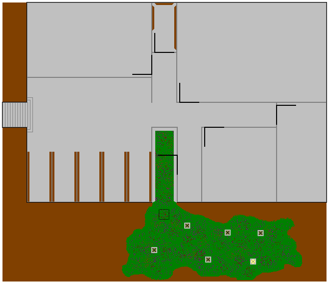
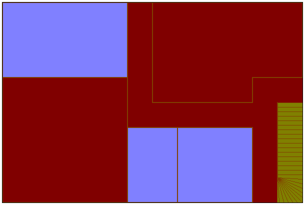
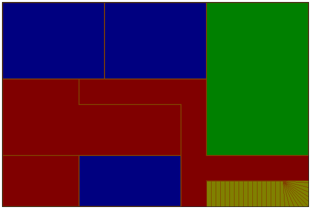

# House in the Forest

## Setting
The land is called Danjukk. The venue for this game is called the Darkpine forest. All the characters grew up around this forest, and all know the dangers of it well.
The scourge of Danjukk is the undead. Nightmarish monsters have been heard of, but anyone who has encountered one is either mad or dead.

Magic in this world is all about manipulating a force called the distortion. It permeates everything and when tweaked in just the right way, can cause all manner of things to happen. From changing the localised direction of gravity to setting someone on fire, creating objects out of raw materials, baffling the senses, transporting oneself instantly across small and vast distances are just some of the applications of this power.

The rarest and most highly sought-after material is called nightshard and it is the prime component in the spellgloves that weaver's use to manipulate the distortion.

## Characters

### Elena Carlyle

### Finn Lawrence

#### Characteristics

**Boysterous**: Finn is a very active and good-natured person, who tends to be the life of the party.

**Charismatic**: Finn's force of personality is enough to draw everyone into his dreams. He makes friends easily, and those he keeps close are very close.

**Cocksure**: What Finn has in abundance is not reasonable caution. He knows there is no problem that can't be overcome by optimism and teamwork.

#### Equipment

**Pair of Revolvers**: Excellent craftsmanship, wonderfully balanced. Their use is a sight to behold. .30 longnose, with magnum and hollowpoint ammunition in dual bandoliers.

**Dynamite**: Don't be anywhere near this when it goes off. ANYWHERE.

**Rope**: 50 feet of ropy goodness. It might come in handy.

#### Description

**Physical**: Finn is a ninja commando, moving fast and hitting hard. He can dodge and weave his way through a crowd of trees and still manage to get a bullet in his target's chest with little difficulty.

**Mental**:

**Social**: Finn is looking to prove himself as a gunslinger, taking down monsters left-right and centre. He fancies himself joining the Leatherjackets after this, using the excursion as a mark of pride in his application.

#### Relationships

**Sean Murphey**: Your best mate. Sean is stone to your fire, and you can't imagine the day you can't depend on him. Sure, he's dating Elena now, but you don't mind that at all.

**Sam Lawrence**: Your kid brother is a little lame, but the stuff he can put together with a little old junk is amazing. It's a pity he's such a closet-case, or he might be really popular.

**Elena Carlyle**: Your ex-girlfriend. Elena is hot, and a master-grade spellcaster to boot. You aren't sure why she broke up with you, but you've accepted the fact and have learned to treat her as a friend.

**Markus Smithe**: Markus is pretty cool, he helped you out after Elena broke up with you. The others don't seem to like him much, but they're just being elitist. He seems happy enough to hang around with the group.

**Lilith Hampton**: Elena's best friend. Lilith is really quiet, so there isn't much to say about her really. You know she's a spellcaster because you've seen her healing herself before, so she's got skills for the adventure.

### Lilith Hampton

### Markus Smithe

#### Characteristics

**Cunning**:

**Smooth**:

**Sociopathic**:

#### Equipment

**Longknife**:

**Spellgloves**:

### Sam Lawrence

### Sean Murphey

#### Characteristics

**Pragmatic**: Sean will adapt to the fluidity of the situation readily, making sure to optimise his position at all times. The momentum of chaos provides a free source of action, don't squander it.

**Sensible**: Sean doesn't make rash decisions. At any given oppertunity, he will choose the siege instead of the assault, you can do far more damage that way.

**Paranoid**: Sean doesn't have a crippling suspicion of everyone and everything. What he does have however, is a healthy respect for the worst case scenario, and will attempt to minimise the possibility of this occuring whenever possible. Sean is always ready.

#### Equipment

**.30 lever-action**: A beautiful rifle with a custom-built spyglass, attached in such a way so that when locked into place, acts as a sighting mechanism for long range shooting. A marvel of engineering. They'll never see the bullet coming.

**Pepperbox pistol**: Four shots, it's all it can get off, and it'll never be enough. You keep it wherever you need, to access it at the drop of a pin. It makes you feel that little bit safer when you close your eyes. Or for that matter when they're open.

#### Relationships

**Finn Lawrence**: Finn is a good friend, if you could call anyone a friend. He's just to preoccupied with himself to be a threat, and from what you've learnt playing poker with him, he's not a good bluff. He doesn't seem to mind that you are dating his ex-girlfriend Elena, maybe not all breakups are messy, though he may be a better bluff than you thought.

**Sam Lawrence**: Sam is an interesting case. While you appreciate the work he does, his total devotion to his brother colours his every action. He is capable of incredible acts of deviousness, and since he makes the team's equipment, he has the oppertunity to capitalise on that quite effectively. That's why you don't use his gadgets.

**Elena Carlyle**: Elena is your bedfellow, and confuses you to no end. She seems so like you sometimes, absorbed so totally in her studies, cut off from the outside world. Sometimes however, when you lie together, it feels so tender, so loving. Maybe you are softer than you thought. Maybe this is bad for you. Maybe you don't care.

**Markus Smithe**: Danger. This kid makes you look sly, he's so cold. He's a shadowcaster, so you have to be extra vigilant when you don't know where he is. Finn says that he's cool, and you've played poker a few times with him (a damn good bluff), but as far as you are concerned, he's still a stranger. He seems to behave oddly around Lillith however, better keep an eye on that.

**Lilith Hampton**: Lillith makes no sense; she seems to have no concept of malice or deception and her eyes see more than they ought to. She's like a rabbit in a den of lions; you can't help but think, that's one special rabbit. By that merit you keep an eye on her. She's Elena's friend, but if she turns out to be some kind of figment, she might just become a nightmare.

## Chapter I: The House

### Outline

Characters should arrive, walk from room to room and trigger the events encoded therein. This will build up suspense and a growing sense of wierdness.

A notable event is the Laundry room collapse. This forces players to get their friend out of the cell below. Which provides the hook for the transition into the next section.

### History

The house was home to a family in the early days of Dannjukk (before the undead became widespread), but one day, the father saw somethin that he shouldn't have, something that set a seed of corruption in his mind.

Over time, his derangement caused him to make changes to his house, creating a cell and a shrine in the basement. He would then sacrifice travellers, servants and friends to 'the light' in an attempt to gain it's favour. Eventually he sacrificed his wife and children in their beds, using his newly found power to take him to the wasteland. There he inhabits the cathedral of blood, waiting.

### In the House

The cell can be easily opened, the key in the study is for the shrine. There is a ghostly presence in the cell. A figure can be seen sobbing naked in the corner, flesh covered in sigils carved in its flesh.

The basement is totally rearranged to get rid of most of the empty space and put in a shrine. The shrine is a portal to the wasteland, which will draw people in.

### Locations

#### Outside

##### CROSSROADS

As is often the case in the dark forest, no sunlight shines through the canopy above. The path is lit only by death lanterns (a type of glowing vine flower) and the occasional fireshroom (firefly mushrooms). It is as though the forest is in a perpetual twilight, and if not for its deadly and sinister nature, it might actually be beautiful.

A dilapidated sign stands tall in the centre of the place, and even though people avoid this route, no overgrowth seems to have sprung up anywhere inconvenient. The sign shows the directions: “North – to Fendriddle” “South – to Endrishim” “West – to Caderson, East – tc tno C.rca.l 3or.cw” East being worn almost beyond recognition and the direction of the house.

* Anyone who doesn’t know from relevant experience that death lanterns are harmless and that touches a one receives Note 1.
* Examining the eastern sign causes the examiner to receive Note 2.
* Anyone attempting to leave the crossroads by any path other than East, will receive Note 3.

Links: crossroads, path

##### PATH

The path continues the eerie and disturbing beauty of the crossroads. The players can detect a slight incline and an overall right curve if they pay attention to it at all. After about 10 minutes, the light starts to fade away as there become less and less fireshrooms and death lanterns, though the path continues unconcerned. Within another 5 minutes, the path is pitch black. Everyone knows how dangerous it is to continue without some form of light, since the place is infested with wraiths.

The players need to create some form of light, and several options are available:
* Pick some fireshrooms and death lanterns and use them to light the way.
* Grab some wood and moss, dope it with fireshroom goop and set it ablaze (the goop is flammable).
* Conjure up a magical light (provides the conjurer with Note 4).

Any attempt to continue without light will provide Note 5.

Links: crossroads, house approach

##### HOUSE APPROACH

As the incline of the path increases, it opens up, revealing a two-story house., smoke coming from the chimney. To the right is a funny shaped rock sitting under a tree. One of the trees branches has a glint in it.

* Looking at the rock closer provides Note 6.
* Investigating the glint in the tree provides a bronze key, the handle decorated with the motif of a sobbing child.

Links: path, north garden

##### NORTH GARDEN

Heading toward the front door, you see that the garden stretches around both sides of the house. The existence of a basement is easily surmised by the solid nature of the house’s foundations and the occasional small grating. The front porch of the house

Links: house approach, south garden, front porch

##### SOUTH GARDEN

//

Links: north garden, south corridor, vegetable garden

##### VEGETABLE GARDEN

//

Links: south garden, cesspit

##### FRONT PORCH

//

Links: north garden, north corridor

#### Basement

##### BASEMENT ENTRANCE

//

Links: south garden, basement corridor

##### BASEMENT CORRIDOR

//

Links: basement entrance, storage room, closet, workshop, cell, ritual room, cesspit

##### STORAGE ROOM

//

Links: basement corridor

##### CLOSET

//

Links: basement corridor

##### WORKSHOP

//

Links: basement corridor

##### CELL

//

Links: basement corridor

##### RITUAL ROOM

//

Links: basement corridor

##### CESSPIT

//

Links: basement corridor

#### Ground Floor

##### NORTH CORRIDOR

//

Links: front porch, kitchen, dining room, lounge, south corridor

##### KITCHEN

//

Links: north corridor, dining room

##### DINING ROOM

//

Links: north corridor, kitchen

##### LOUNGE

//

Links: north corridor, south corridor

##### SOUTH CORRIDOR

//

Links: north corridor, bathroom, laundry, upstairs corridor, south garden

##### BATHROOM

//

Links: south corridor

##### LAUNDRY

//

Links: cell, south corridor

#### Upstairs

##### UPSTAIRS CORRIDOR

//

Links: south corridor, guest room, bedroom, nursery, master bedroom, library (locked)

##### GUESTROOM

//

Links: upstairs corridor

##### BEDROOM

//

Links: upstairs corridor

##### NURSERY

The cot has a dark stain on it.

Links: master bedroom, upstairs bedroom

##### MASTER BEDROOM

//

Links: nursery, upstairs corridor, office

##### OFFICE

This is where the players will find the key to the cell and a blank journal.

Links: master bedroom, library

##### LIBRARY

An octagonal room where the walls are covered with bookcases.

Links: office, upstairs corridor

### Notes

1. SINGULAR: As you disturb the flower, the vine suddenly mobilises. A gout of searing acid sprays from the now dull flower of the animate plant, burning horribly into the soft flesh of your unprotected face. You feel the worst kind of agony as your eyeballs pop and your skin melts off. You wake up from your daymare screaming.
Gain a derangement point.

2. MULTIPLE: The sign looks worn and decrepit, the writing dark and faded. Looking closer, you can see that moss has obscured most of the detail. Taking this into account reveals that the destination appears to be “The Dread Barrows”.
Gain a disturbance point.

3. MULTIPLE: After a few minutes of winding pathway though a dim corridor of foliage, you arrive at a crossroads. It looks incredibly familiar.
Gain a disturbance point.

4. MULTIPLE: As you crawl forward, images of wraiths plague your mind. Every brush of weed or sudden breeze is a wraith moving around you, playing. As you put your hand down to move forward, you realise that it’s resting on a tree root. You swing your arms out to get some idea of where you are, but the only thing they meet is coat. Wraith coat. You wake up.
Gain a derangement point.

5. MULTIPLE: As the light shines forth, illuminating the path, you all have the feeling that you are being watched. As you look around to confirm your paranoia, the light shines further into the trees, illuminating the faces of dozens of wraiths, all watching you intently. A second later they fade further into the darkness.
Gain a disturbance point.

6. SINGULAR: Looking closer at the rock, you come to the slow chilling realisation that it is in fact a human skull, and looks like it has been cleaned. A blink and a shake of your head returns the skull back to a funny shaped rock.
Gain a disturbance point.

